# Cea Salud

La clínica Cea Salud, especialista en salud, cuenta actualmente con consultorios (6 en la actualidad),
dos laboratorios (físicos en la clínica), y una sala de espera general. Está abierta al público de lunes a
viernes en el horario de 8:00 a 19:00, y los sábados en el horario de 8:00 a 14:00.

Trabajan en ella profesionales de diversas especialidades, que ocupan los consultorios acorde a su
disponibilidad, y reciben en ellos pacientes con turno para consulta o tratamiento. Dichos turnos son
pedidos por la web seleccionando el profesional o la especialidad. La duración mínima de un turno es
30 minutos.” pero los profesionales pueden cambiar la duración según su especialidad. Estos
profesionales pueden tener más de una especialidad.

También contamos con un sector dentro de la clínica que se encarga de la organización y
administración de la misma.

# Casos de uso
## I. Inicio de sesión

Al inicio del portal de la clínica, y si aún no tenemos usuario logueado, nos encontraremos con una pantalla de bienvenida donde podremos ingresar las credenciales de acceso.

Asimismo, para agilizar el proceso de evaluación del trabajo práctico contaremos con botones de acceso rápido que ingresará las credenciales correspondientes y nos permitirá iniciar sesión:

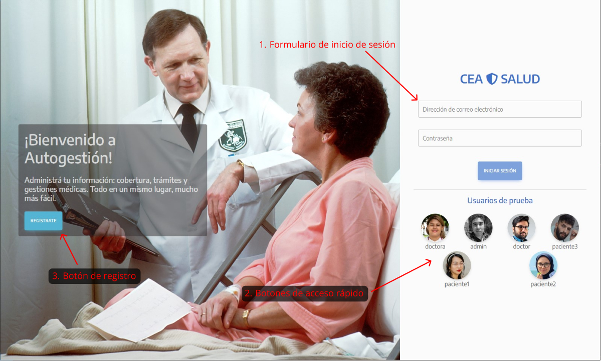

## II. Registro de usuario

En caso de tener que registrarse como usuario, nos dirigiremos al botón indicado en el punto 3. de la imagen anterior.

Eso nos enviará a la vista de selección de tipo de usuario, que puede ser de Paciente o Especialista:

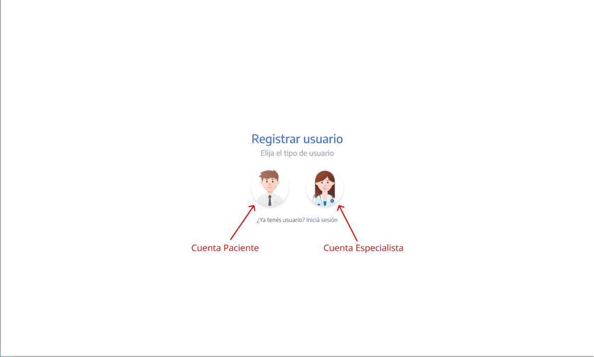

### II.A. Registro de Paciente

Al seleccionar el registro de un nuevo paciente, debemos llenar los siguientes campos enumerados, según se especifica en la imagen debajo.

1. Nombre del paciente
2. Apellido del paciente
3. Edad del paciente (debe ser mayor de 18 años)
4. Número de DNI (ingresar sólo números, no incluir puntos)
5. Nombre de Obra Social (en caso de no tener una afiliación, puede ingresar "Ninguna")
6. Dirección de correo electrónico asociado al paciente
7. Contraseña
8. Repetir contraseña para verificación
9. Imagen principal para el perfil
10. Imagen secundaria para el perfil

Una vez registrado el paciente, SE ENVIARÁ UN CORREO DE VALIDACIÓN PARA ACTIVAR LA CUENTA.

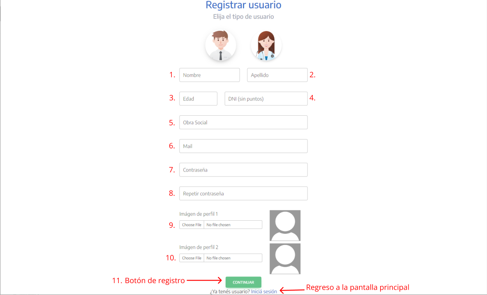

### II.B. Registro de Especialista

En el caso de registrar a un nuevo especialista, los campos a rellenar son los siguientes, también indicados en la imagen a continuación:

1. Nombre del especialista
2. Apellido del especialista
3. Edad del especialista
4. Número de DNI (ingresar sólo números, no incluir puntos)
5. Seleccionar la especialidad del doctor *(en caso de seleccionar "Otra", indicar en el campo correspondiente)
6. Dirección de correo electrónico asociado al especialista
7. Contraseña
8. Repetir contraseña para verificación
9. Imagen de perfil del especialista

Una vez registrado el especialista, SE ENVIARÁ UN CORREO DE VALIDACIÓN PARA ACTIVAR LA CUENTA.

También deberá contactar a su administrador para que el mismo habilite su cuenta.

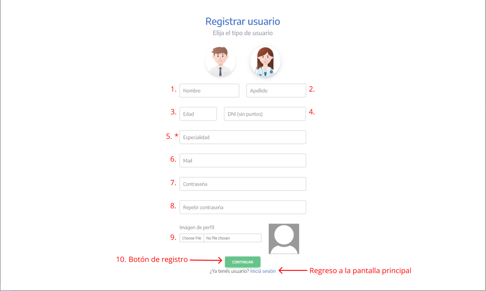

## III. Sección principal

Una vez iniciada la sesión, nos encontraremos con la interfaz principal de usuario.

Actualmente, podremos ingresar al Perfil para ver sus datos, y también a la sección Turnos para poder atenderse. Yendo a la sección superior de la pantalla tendremos la opción de cerrar la sesión activa.

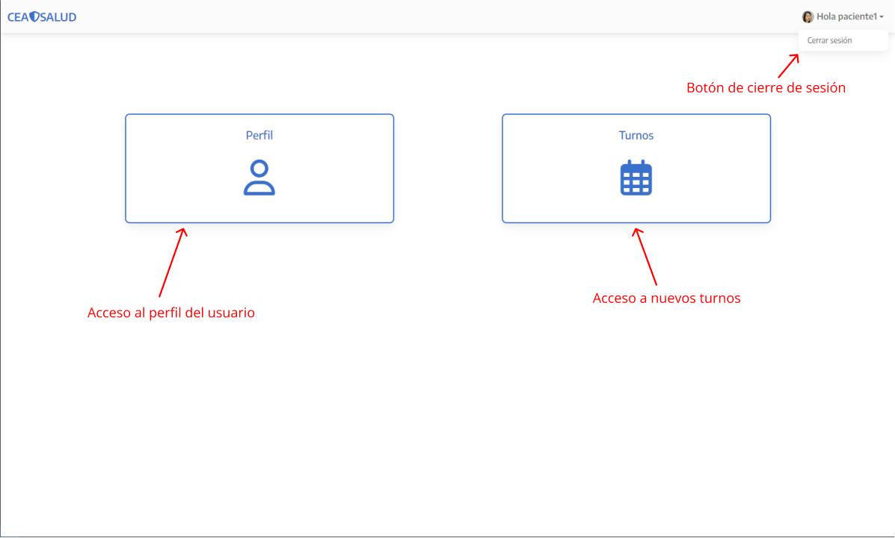

## IV. Perfil de usuario

Al presionar sobre el botón Perfil, podremos observar la información del usuario, y en el caso de ser un especialista también podremos asignar la disponibilidad horaria según día y especialidad.

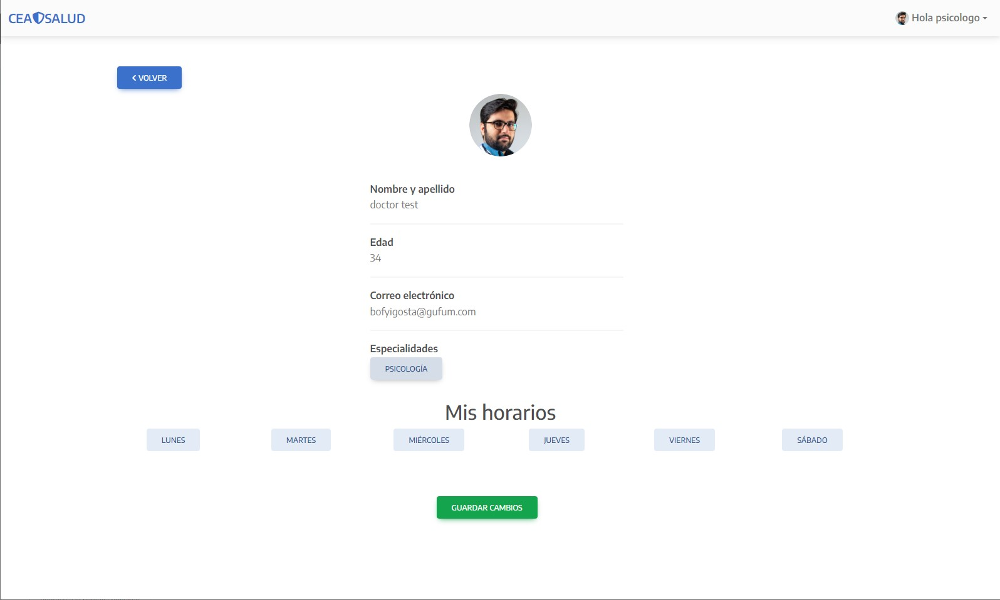

Para habilitar o deshabilitar horarios, debemos presionar sobre uno de los botones de las especialidades para seleccionarla. Luego elegimos el día de la semana para que se abra la lista de horarios y allí mismo cliquear los botones para ir habilitandolos uno por uno (presionar nuevamente para deshabilitar el horario).

Finalmente deberemos guardar estos cambios con el botón verde correspondiente

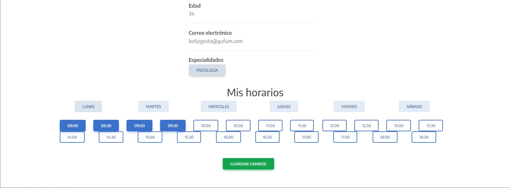

## V. Solicitud de turno nuevo

Al presionar sobre el botón Turnos, nos dirigiremos a la interfaz de solicitud de nuevo turno.

Allí mismo podremos seleccionar a nuestro especialista de confianza, alguna de sus especialidades, las fechas disponibles y horario del turno.

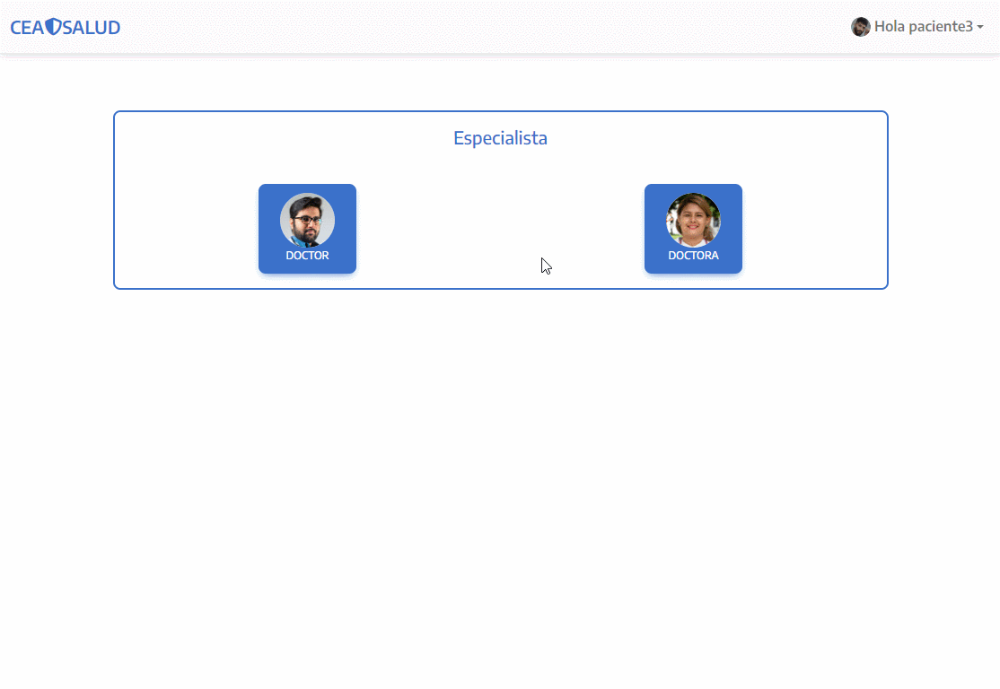

## VI. Ver listado de turnos

TBD

# Admin

Además de los casos de uso indicados anteriormente, mencionaremos las funcionalidades disponibles a los usuarios administradores.

## Ver listado de pacientes y especialistas

Al ingresar con un usuario administrador, nos encontraremos con la pantalla inicial de navegación. Desde aquí iremos a la sección Usuarios

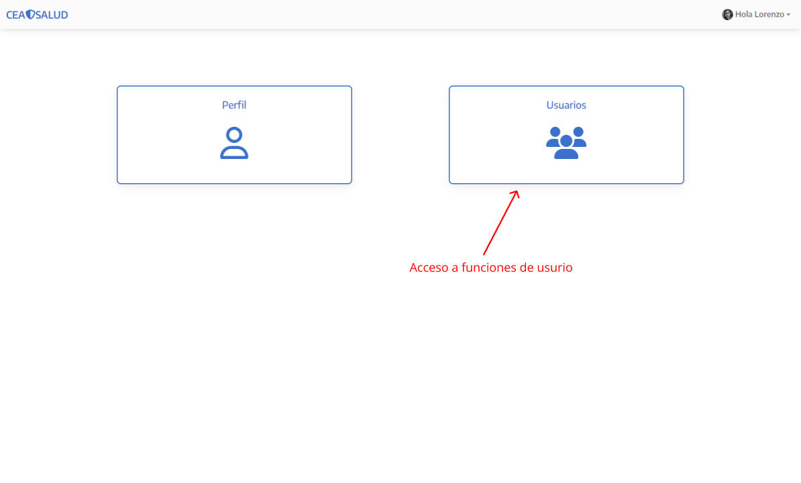

Allí mismo podremos visualizar el listado de pacientes registrados y especialistas seleccionando las pestañas correspondientes.

Además contamos con la opción de exportar cada una de estas listas a un archivo de Excel

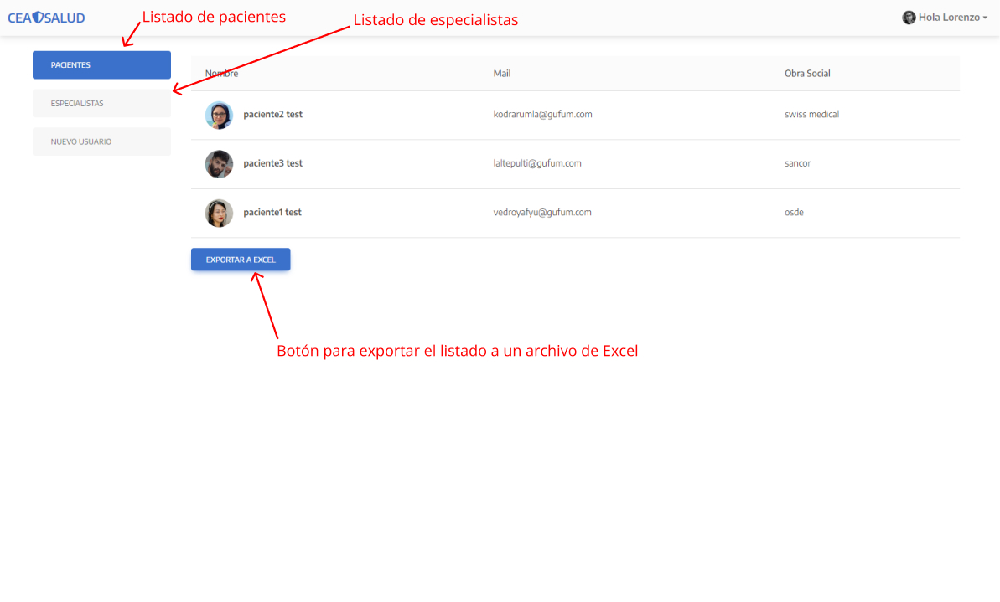

Yendo al listado de especialistas tendremos disponible la opción para habilitar o deshabilitar a los especialistas de manera individual.

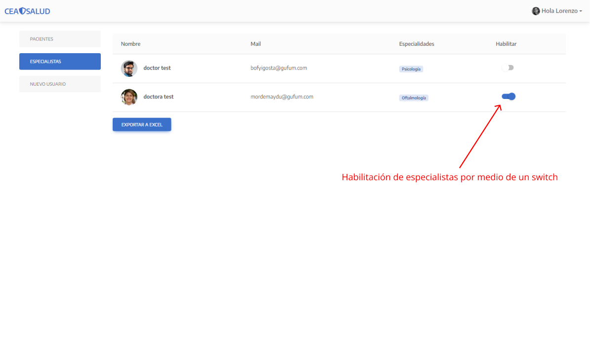

Por último, desde esta sección podremos crear usuarios nuevos (incluyendo nuevos administradores) yendo al botón de "NUEVO USUARIO", y completando el formulario de manera similar al de la [sección II](#ii-registro-de-usuario)

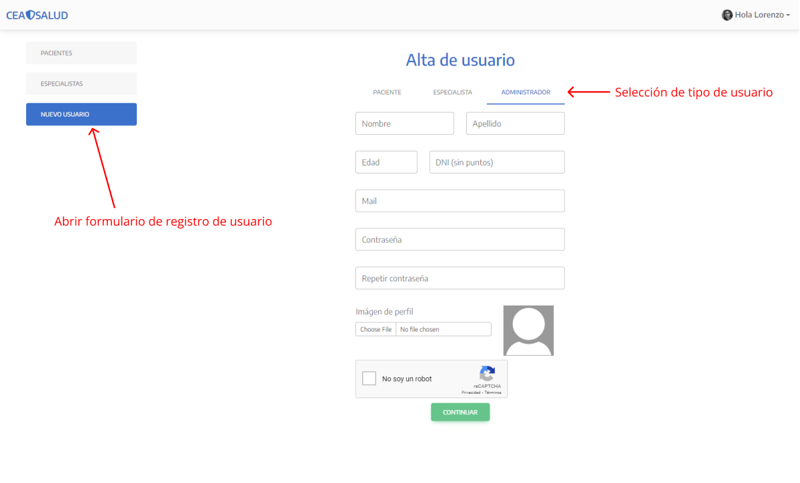